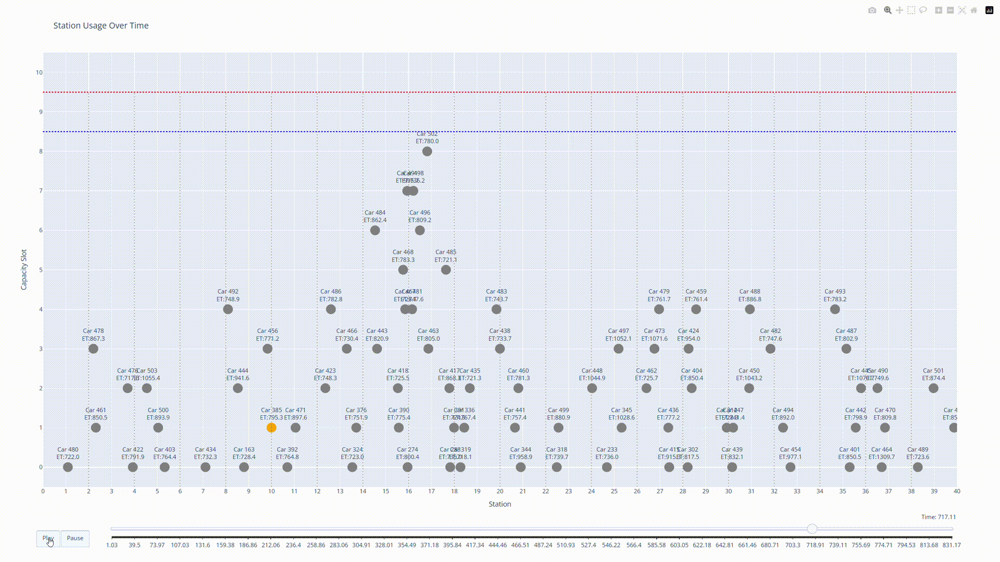

# SC4054 Assignment: Simulation of a Cellular Telephony Network

A discrete-event simulation of a cellular telephony network along a highway with multiple base stations.



## Getting Started

### Running the Simulation with Animation

```bash
python Animation.py
```

### Running Tests

```bash
pytest
```

## Components

The project contains the following key components:

1. **Simulator (simulator.py)**: Core discrete-event simulation engine that models the cellular network
2. **Generator (generator.py)**: Generates random variables following specified distributions
3. **Animation (Animation.py)**: Provides visualization of the simulation
4. **Jupyter Notebooks**:
   - **input_modeling.ipynb**: Analysis and modeling of input distributions
   - **output_analysis.ipynb**: Statistical analysis of simulation results
