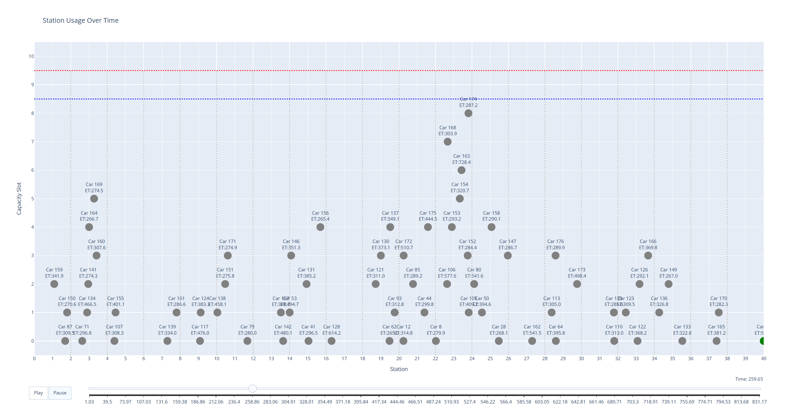

# ASSIGNMENT 1: Simulation of a Cellular Telephony Network


> **Name:** Lim Song Wei, Greg
> **Matric No.:** U2120517G

# 1. Selection of distribution and parameters

## 1.1 Data Independence Analysis

To verify the independence of variables in our dataset, we analyzed the correlation matrix and created scatter plots to visualize relationships between variables.


*Figure 1.1: Scatter matrix showing the relationships between different variables*

From the correlation matrix and scatter plots, we observed that the variables (Call Duration, Inter-arrival Time, Velocity, and Base Station) are independent of each other, allowing us to model each variable separately.

## 1.2 Call Duration Analysis

### 1.2.1 Distribution Selection

Based on the histogram of call duration data, we observed that the distribution resembles an exponential distribution with a shift.

### 1.2.2 Parameter Estimation

For the Shifted Exponential distribution: $X \sim \text{ShiftedExponential}(\lambda, x_0)$

The probability density function (PDF) is given by:

$$f(x) = \begin{cases} \lambda e^{-\lambda (x - x_0)} & x \geq x_0 \\ 0 & x < x_0 \end{cases}$$

Using Maximum Likelihood Estimation (MLE), the parameters are estimated as:

$$\hat{x_0} = \min(x)$$
$$\hat{\lambda} = \frac{1}{\bar{x} - x_0}$$

Where $\bar{x}$ is the sample mean and $x_0$ is the shift parameter.

For simplicity, we assume $x_0 = 10.000$ (since $\min(x) = 10.004$ and $x_0 \leq \min(x)$).

Our parameter estimates are:
- $\hat{x_0} = 10.000$ (shift parameter)
- $\hat{\lambda} = 0.010016437243961146$ (rate parameter)


*Figure 1.2: Call Duration histogram with fitted Shifted Exponential PDF*

### 1.2.3 Goodness-of-fit Testing

We used the Chi-square test at a 5% significance level to evaluate the goodness of fit.

$H_0$: The data conforms to the shifted exponential distribution
$H_1$: The data does not conform to the shifted exponential distribution

The Chi-square test was performed with $k = \sqrt{n} = 100$ bins, where $n = 10,000$ is the sample size.
The result of the test indicates that we fail to reject the null hypothesis, confirming that the call duration data follows a shifted exponential distribution.

## 1.3 Inter-arrival Time Analysis

### 1.3.1 Distribution Selection

Based on the histogram of inter-arrival time data, we observed that the distribution resembles a standard exponential distribution.

### 1.3.2 Parameter Estimation

For the Exponential distribution: $X \sim \text{Exponential}(\lambda)$

The probability density function (PDF) is given by:

$$f(x) = \lambda e^{-\lambda x}$$

Using Maximum Likelihood Estimation (MLE), the rate parameter is estimated as:

$$\hat{\lambda} = \frac{1}{\bar{x}}$$

Where $\bar{x}$ is the sample mean.

Our parameter estimate is:
- $\hat{\lambda} = 1.3698168816881688$ (rate parameter)


*Figure 1.3: Inter-arrival Time histogram with fitted Exponential PDF*

### 1.3.3 Goodness-of-fit Testing

We used the Chi-square test at a 5% significance level to evaluate the goodness of fit.

$H_0$: The data conforms to the exponential distribution
$H_1$: The data does not conform to the exponential distribution

The Chi-square test indicated that we fail to reject the null hypothesis, confirming that the inter-arrival time data follows an exponential distribution.

## 1.4 Velocity Analysis

### 1.4.1 Distribution Selection

Based on the histogram of velocity data, we observed that the distribution resembles a normal distribution.

### 1.4.2 Parameter Estimation

For the Normal distribution: $X \sim N(\mu, \sigma^2)$

The probability density function (PDF) is given by:

$$f(x) = \frac{1}{\sqrt{2\pi \sigma^2}} e^{-\frac{(x - \mu)^2}{2\sigma^2}}$$

Using Maximum Likelihood Estimation (MLE), the parameters are estimated as:

$$\hat{\mu} = \bar{x}$$
$$\hat{\sigma^2} = s^2$$

Where $\bar{x}$ is the sample mean and $s^2$ is the sample variance.

Our parameter estimates are:
- $\hat{\mu} = 120.0720949$ (mean)
- $\hat{\sigma} = 9.01905562259854$ (standard deviation)


*Figure 1.4: Velocity histogram with fitted Normal PDF*

### 1.4.3 Goodness-of-fit Testing

We used the Chi-square test at a 5% significance level to evaluate the goodness of fit.

$H_0$: The data conforms to the normal distribution
$H_1$: The data does not conform to the normal distribution

The Chi-square test indicated that we fail to reject the null hypothesis, confirming that the velocity data follows a normal distribution.

## 1.5 Base Station Distribution Analysis

### 1.5.1 Distribution Selection

Based on the histogram of base station data, we observed that the distribution resembles a uniform distribution.

### 1.5.2 Parameter Estimation

For the Uniform Discrete distribution over the range [1, 20]:

The probability mass function (PMF) is given by:

$$f(x) = \frac{1}{20} \quad \text{for } x \in \{1, 2, \ldots, 20\}$$

No parameter estimation is required as the start and end points are known.


*Figure 1.5: Base Station histogram with fitted Uniform PDF*

### 1.5.3 Goodness-of-fit Testing

We used the Chi-square test at a 5% significance level to evaluate the goodness of fit.

$H_0$: The data conforms to the uniform distribution
$H_1$: The data does not conform to the uniform distribution

The Chi-square test indicated that we fail to reject the null hypothesis, confirming that the base station data follows a uniform distribution.

## 1.6 Summary of Selected Distributions and Parameters

Based on our analysis, we have determined the following distributions and parameters for our simulation:

1. **Call Duration:** Shifted Exponential Distribution
   - $\hat{\lambda} = 0.010016437243961146$ (rate parameter)
   - $\hat{x_0} = 10.000$ (shift parameter)

2. **Inter-arrival Time:** Exponential Distribution
   - $\hat{\lambda} = 1.3698168816881688$ (rate parameter)

3. **Velocity:** Normal Distribution
   - $\hat{\mu} = 120.0720949$ (mean)
   - $\hat{\sigma} = 9.01905562259854$ (standard deviation)

4. **Base Station:** Uniform Discrete Distribution
   - Range: [1, 20]
   - $f(x) = \frac{1}{20}$ for $x \in \{1, 2, \ldots, 20\}$

All distributions were validated using Chi-square goodness-of-fit tests at a 5% significance level, and all null hypotheses were not rejected, confirming our distribution selections.

<div style="page-break-after: always;"></div>

# 2. Simulation Architecture

The simulation employs a discrete-event approach to model a cellular telephony network along a highway with multiple base stations.

## 2.1 Core Components & Operation

The simulator manages three key event types (call initiation, handover, and termination) and maintains the following elements:

- **Car Model**: Each car represents a mobile user with attributes including ID, velocity, call duration, position, and base station. Car objects are inmutable on creation and current position and base station can be determined by simulation clock and time of car creation.

- **Event Processing**: Events are chronologically ordered in a priority queue. Each event may result in statistical updates (blocked/dropped/completed calls) and may schedule future events.

# 3. Verification & Validation

## 3.1 Testing

The simulation was verified using a multi-level testing strategy:

### 3.1.1 Runtime Assertions

The simulator includes runtime checks to maintain model integrity:

```python
assert time >= self.clock, f"Event time {time} is less than current clock {self.clock}."
assert i <= TOTAL_CHANNELS, f"Base station channels exceeded: {i} > {TOTAL_CHANNELS}"
assert i >= 0, f"Base station channels negative: {i} < 0"
```

These assertions ensure that:
- Events are processed in chronological order
- Channel usage stays within system limits
- No negative channel counts occur

### 3.1.2 Unit Testing

Unit tests in `test_simulator.py` verify individual components and system behavior:

- **Car Model Tests**: Verify direction calculation, station transitions, and time calculations
- **Event Scheduling Tests**: Confirm proper event ordering in the priority queue
- **Event Handler Tests**: Validate behavior for initiation, handover, and termination
- **Channel Reservation Tests**: Ensure proper operation of handover channel reservation

### 3.1.3 Integration Testing

Long-running tests in `test_simulator_long.py` verify system stability:

- **Resource Release Tests**: Confirm all channels return to zero after all calls complete
- **Event Completion Tests**: Verify events are processed completely without residuals
- **Statistical Consistency**: Check that blocked/dropped/completed call counts are consistent

## 3.2 Animation

The animation component (`Animation.py`) provides visual verification of the simulation's correctness through dynamic visualization.

### 3.2.1 Visual Verification

The animation enables visual confirmation of several key behaviors:

- **Call Flow**: Tracking calls as they progress through the highway system
- **Channel Usage**: Real-time monitoring of channel allocation and release per station
- **Event Handling**: Color-coded visualization showing different event outcomes:
  - Blue: Call initiation
  - Orange: Handover
  - Green: Normal completion
  - Red: Blocked calls
  - Purple: Dropped calls during handover

#### System Initialization


*Figure 3.1: Animation screenshot showing the initial state of the simulation with base stations positioned along the highway and available channels.*

#### Call Initiation and Handover


*Figure 3.2: Animation screenshot demonstrating handover events as cars move between base station coverage areas. Orange indicators show successful handover transitions.*

#### Call Termination


*Figure 3.3: Animation screenshot showing normal call termination (green indicators) when calls complete successfully within a base station's coverage area.*



*Figure 3.4: Animation screenshot showing call termination at the edge of the simulation area as cars exit the highway system. (the green dot is at the bottom right)*

#### Blocked Calls


*Figure 3.5: Animation screenshot demonstrating blocked calls when all available channels are occupied at a base station. Red indicators show blocked call attempts when no non-reserved channels are available.*

#### Dropped Calls


*Figure 3.6: Animation screenshot demonstrating dropped calls when handover attempts fail due to lack of available channels at the target base station. Purple indicators show dropped calls during handover attempts.*

### 3.2.2 Channel Reservation Validation

The animation clearly highlights reserved channels with a blue line, making it easy to verify that:
- New calls are blocked when only reserved channels remain
- Handovers successfully use reserved channels when available
- Channel allocation follows the reservation policy

This visual approach provides intuitive verification beyond numerical results, effectively demonstrating the simulation's dynamic behavior and protocol adherence.

# 4. Output Analysis

After verifying the simulation's correctness, we conducted a thorough output analysis to determine the optimal number of channels to reserve for handovers and to analyze the system's performance characteristics.

## 4.1 Steady State Analysis

To ensure the simulation results represent the system's steady-state behavior, we first identified the warm-up period by analyzing the stability of key performance metrics over time.

### 4.1.1 Determining the Warm-up Period

We conducted an initial set of 10 simulation runs with 100,000 steps each (divided into 100 big steps of 1000 steps each) for each channel reservation policy (0 and 1 reserved channels). The goal was to identify when the system reached steady state.


*Figure 4.1: Steady state analysis of blocked and dropped call percentages across simulation runs. Dashed lines indicate estimated steady state points.*

To identify when the system reaches steady state, we used a variance-based approach that compares the variance of metrics in consecutive windows. When the variance stabilizes (within a tolerance of ±10%), the system is considered to have reached steady state.

Based on this analysis, we determined that:
- For 0 reserved channels: Steady state was reached around step 30,000
- For 1 reserved channel: Steady state was reached around step 34,000

To ensure the reliability of our results, we selected a warm-up period of 35,000 steps.

### 4.1.2 Post-Warmup Behavior Verification

After determining the warm-up period, we conducted additional simulations, excluding the warm-up data, to verify the stability of the steady-state behavior:


*Figure 4.2: Performance metrics after removing the warm-up period, demonstrating stable steady-state behavior.*

The post-warmup analysis confirms that the system stabilizes after the warm-up period, with consistent blocked and dropped call percentages for both channel reservation policies.

## 4.2 Sample Size Determination

To ensure the statistical significance of our results, we used a pilot study to determine the required number of simulation runs. Using a target half-width of the confidence interval of 0.002 with a 95% confidence level, we calculated the required sample size using:

$$n \geq n_0 \times \frac{\delta^2}{\beta^2}$$

Where:
- $n_0$ is the pilot sample size
- $\delta$ is the half-width of the confidence interval from the pilot study
- $\beta$ is the target precision

Based on this analysis, we determined that approximately 225 simulation runs were needed to achieve the desired precision.

## 4.3 Final Results and Analysis

After completing the required number of simulation runs with the identified warm-up period, we obtained the following performance metrics:

### 4.3.1 Channel Reservation Performance Comparison

**Channel Reservation = 0:**
- Dropped calls: 0.0058 ± 0.0001 (95% CI)
- Blocked calls: 0.0034 ± 0.0001 (95% CI)

**Channel Reservation = 1:**
- Dropped calls: 0.0034 ± 0.0001 (95% CI)
- Blocked calls: 0.0109 ± 0.0002 (95% CI)

### 4.3.2 Trade-off Analysis

The results demonstrate a clear trade-off between blocked calls and dropped calls across the two channel reservation strategies:

1. **No Channel Reservation (0 reserved):**
   - Lower blocked call rate (0.34%)
   - Higher dropped call rate (0.58%)

2. **One Channel Reserved for Handover:**
   - Lower dropped call rate (0.34%)
   - Higher blocked call rate (1.09%)

This trade-off occurs because reserving a channel for handovers reduces the number of channels available for new calls, leading to more blocked calls. However, it ensures that more handovers can be completed successfully, reducing the number of dropped calls.

### 4.3.3 Statistical Significance

The confidence intervals for all metrics are relatively narrow (±0.01-0.02 percentage points), indicating high statistical precision in our results. The non-overlapping confidence intervals between the two strategies confirm that the differences in performance metrics are statistically significant.

### 4.3.4 QoS Requirements Assessment

The project requirements specified the following QoS criteria:
- Blocked calls < 2%
- Dropped calls < 1%

Based on our simulation results:

1. **No Channel Reservation (0 reserved):**
   - Blocked calls: 0.34% ✓ (meets requirement)
   - Dropped calls: 0.58% ✓ (meets requirement)

2. **One Channel Reserved for Handover:**
   - Blocked calls: 1.09% ✓ (meets requirement)
   - Dropped calls: 0.34% ✓ (meets requirement)

Both channel reservation strategies meet the QoS requirements specified by XPhone. However, they offer different performance characteristics that might be preferred depending on the telecommunications company's strategic priorities.

## 4.4 Conclusion and Recommendations

### 4.4.1 System Performance Assessment

Our simulation analysis confirms that the current system with 10 channels per base station is capable of meeting the Quality of Service requirements specified by XPhone (blocked calls < 2% and dropped calls < 1%), regardless of whether channels are reserved for handovers.

### 4.4.2 Optimal Channel Reservation Strategy

While both strategies meet the QoS requirements, we recommend the following approach:

**Recommendation: Reserve 1 channel for handover**

Justification:
1. Both strategies meet the QoS requirements, but the strategy with 1 reserved channel provides a substantial reduction in dropped calls (0.58% → 0.34%, a 41% reduction).
2. While this increases blocked calls (0.34% → 1.09%), blocked calls are generally less problematic for user experience than dropped calls, as users can simply retry a blocked call.
3. Dropped calls represent an interruption of an ongoing service, which typically creates more customer dissatisfaction than a blocked new call attempt.
4. The blocked call percentage (1.09%) with 1 reserved channel still remains well below the 2% requirement, providing a comfortable margin for potential traffic increases.


